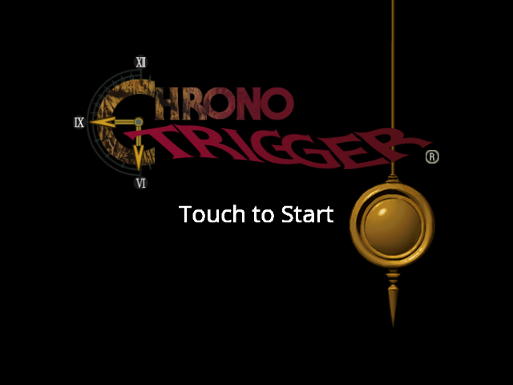
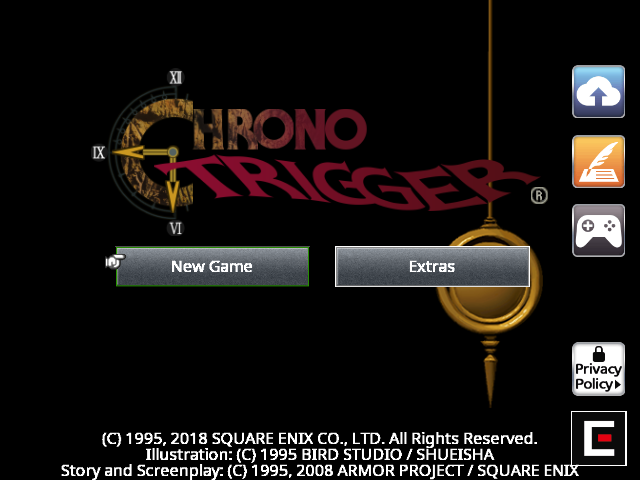
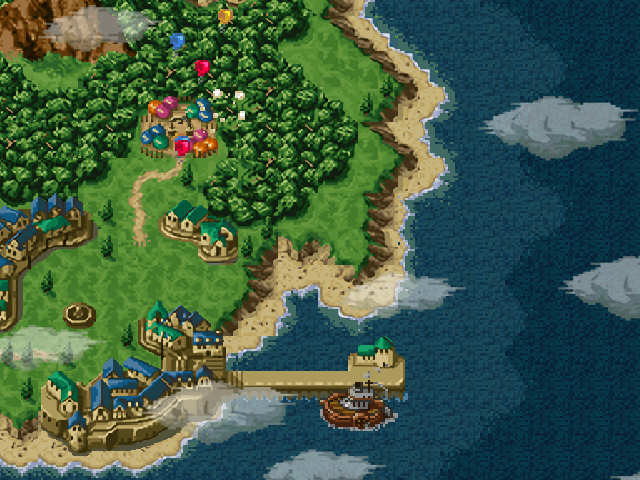
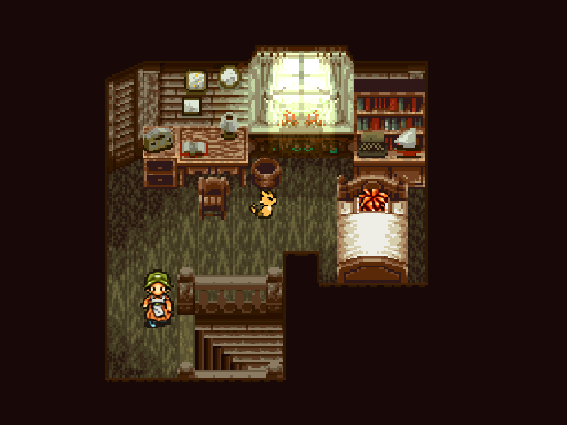
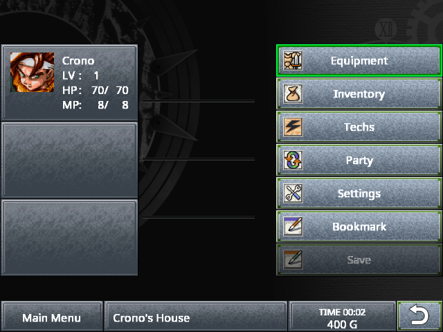

# Chrono Trigger — NextOS Ports

A native Linux port of the Android release of **Chrono Trigger** (Cocos2d-x
3.14.1, GLES2) for retro handhelds. The port is a **compatibility loader**: it
maps the game's original AArch64 Android libraries into a Linux process,
replaces the Android runtime they expect (JNI, OpenSL ES, asset manager,
`Cocos2dxBitmap` text rendering) and drives the Cocos2d-x render loop on the
firmware's own SDL2/EGL/GLES2.

**No game data is distributed here.** You supply the Chrono Trigger APK you
legally own; the bundled installer (NXExtract) extracts, validates and
publishes it on the device.

## Screenshots







All captures come from the game running on an R36S at 640×480.

## Community

Questions, device reports and bug reports: <https://discord.gg/DHfY62eDNN>

## Install

See [INSTALLATION.md](INSTALLATION.md) for the full walkthrough. Short version:

1. unzip into your firmware's `ports/` folder;
2. drop your own Chrono Trigger APK (arm64) into `chrono/gamedata/`;
3. launch **Chrono Trigger** from the Ports menu.

## Devices

Support is stated by **level of evidence**, never as "all devices".

| Device / firmware | Video | Evidence |
|---|---|---|
| R36S / RG351MP class — ArkOS (AArch64, glibc 2.30, KMSDRM, 640×480, 639 MB RAM) | KMSDRM + GLES2 | **physically validated** on this release |
| NextOS Elite (Amlogic, Mali-450 fbdev, 1280×720) | SDL `mali` + GLES2 | **physically validated** on the original release of this port; the universal build shares the same executable and is pending a regression pass on that hardware |
| Other AArch64 CFWs with SDL2 + GLES2 + FreeType (ROCKNIX, muOS, Knulli/Batocera on 64-bit userland) | detected at runtime | **route designed, not yet validated** — the launcher probes and reports; device reports welcome on Discord |
| Any **32-bit (ARMHF) userland** | — | **not supported.** The original game libraries exist only as `arm64-v8a`; there is no 32-bit build to load. The launcher refuses to start and says so. |

Nothing here is chosen by device name: the runtime detects the ROM root, the
real drawable size, the SDL video/audio backend the firmware opened, the pad
mapping supplied by PortMaster, and adapts.

### Performance

Measured on an R36S (Cortex-A35, Mali-G31, 640×480): **58–60 fps** in menus and
indoor scenes, **~37 fps** on the overworld, which is where the engine is
heaviest on this hardware. Peak resident memory is **350 MB of 639 MB**, so no
texture or scale workaround is needed.

## Controls

Native pad through the game's own `GameController` path — Xbox layout.

| Input | Action |
|---|---|
| D-pad / left stick | navigate, move |
| A | confirm |
| B | cancel |
| X / Y / L / R | as mapped by the game |
| **SELECT + START** | quit (through the game's pause/save path) |

`SELECT + START` also works on handhelds that wire those buttons as
`TRIGGER_HAPPY1/2`, because the exit chord is read from evdev as well as from
SDL. `SIGTERM` from the frontend takes the same shutdown path.

The port does **not** run `gptokeyb`: a key mapper on top would steal the pad
from the native controller path.

## Language

The game picks its string table from the **region code**, not from the language
setting. The loader reports region 1 (English), so the UI, menus and script are
in English. Japanese is never selected.

## Build

```bash
./build_universal.sh     # public AArch64 build, GLIBC <= 2.30 (Debian Buster container)
./package/build-package.sh   # audited public ZIP + SHA-256
```

`build_universal.sh` fails the build if any symbol above `GLIBC_2.30` appears,
if the Bionic TLS guard pad moves, or if an unexpected `DT_NEEDED` shows up.
SDL2, GLESv2 and FreeType are linked against SONAME-only stubs and resolved
from the target firmware at runtime.

## Credits and licenses

The loader is GPL-3.0 (`LICENSE`). NXExtract is MIT
(`licenses/NXExtract-MIT.txt`), pinned in `nxextract-version.txt`. The bundled
UI font is Noto Sans under the SIL OFL 1.1 (`fonts/OFL.txt`) and stands in for
the Android system font the game expects but does not ship.

Chrono Trigger and all of its data are proprietary works of Square Enix and are
not distributed here. See [NOTICE.md](NOTICE.md).

---

# Português

Port nativo para Linux da versão Android de **Chrono Trigger** (Cocos2d-x
3.14.1, GLES2) para handhelds retro. O port é um **loader de compatibilidade**:
ele carrega as bibliotecas AArch64 originais do jogo dentro de um processo
Linux, substitui o runtime Android que elas esperam (JNI, OpenSL ES, asset
manager, o texto do `Cocos2dxBitmap`) e conduz o loop de render do Cocos2d-x
sobre o SDL2/EGL/GLES2 do próprio firmware.

**Nenhum dado do jogo é distribuído aqui.** Você fornece o APK do Chrono
Trigger que possui legalmente; o instalador embutido (NXExtract) extrai, valida
e publica os dados no aparelho.

### Comunidade

Dúvidas, relatos de aparelho e bugs: <https://discord.gg/DHfY62eDNN>

### Instalação

Passo a passo completo em [INSTALLATION.md](INSTALLATION.md). Resumo:

1. descompacte na pasta `ports/` do seu firmware;
2. coloque o seu APK do Chrono Trigger (arm64) em `chrono/gamedata/`;
3. abra **Chrono Trigger** no menu Ports.

### Aparelhos

O suporte é declarado por **nível de evidência**, nunca como "todos os
aparelhos".

| Aparelho / firmware | Vídeo | Evidência |
|---|---|---|
| R36S / classe RG351MP — ArkOS (AArch64, glibc 2.30, KMSDRM, 640×480, 639 MB de RAM) | KMSDRM + GLES2 | **validado fisicamente** nesta release |
| NextOS Elite (Amlogic, Mali-450 fbdev, 1280×720) | SDL `mali` + GLES2 | **validado fisicamente** na release original deste port; o build universal usa o mesmo executável e está pendente de regressão nesse hardware |
| Outros CFWs AArch64 com SDL2 + GLES2 + FreeType (ROCKNIX, muOS, Knulli/Batocera em userland 64 bits) | detectado em runtime | **rota projetada, ainda não validada** — o launcher sonda e registra; relatos são bem-vindos no Discord |
| Qualquer userland **32 bits (ARMHF)** | — | **não suportado.** As bibliotecas originais do jogo só existem em `arm64-v8a`; não há build 32 bits para carregar. O launcher recusa iniciar e explica o motivo. |

Nada aqui é escolhido pelo nome do aparelho: o runtime detecta a raiz de ROM, o
tamanho real do drawable, o backend de vídeo/áudio que o firmware abriu e o
mapeamento de controle entregue pelo PortMaster.

### Desempenho

Medido num R36S (Cortex-A35, Mali-G31, 640×480): **58–60 fps** nos menus e nas
cenas internas, **~37 fps** no mapa-múndi, que é onde a engine pesa mais nesse
hardware. O pico de memória residente é de **350 MB de 639 MB**, então nenhuma
gambiarra de textura ou de escala foi necessária.

### Controles

Controle nativo pelo caminho `GameController` do próprio jogo — padrão Xbox.

| Comando | Ação |
|---|---|
| Direcional / analógico esquerdo | navegar, andar |
| A | confirmar |
| B | cancelar |
| X / Y / L / R | conforme o jogo mapeia |
| **SELECT + START** | sair (pelo caminho de pausa/save do jogo) |

`SELECT + START` funciona também nos handhelds que ligam esses botões como
`TRIGGER_HAPPY1/2`, porque o combo é lido do evdev além do SDL. O `SIGTERM` do
frontend percorre o mesmo caminho de saída.

O port **não** usa `gptokeyb`: um mapeador por cima roubaria o controle do
caminho nativo.

### Idioma

O jogo escolhe a tabela de textos pelo **código de região**, não pela
configuração de idioma. O loader informa a região 1 (inglês), então a interface,
os menus e o roteiro ficam em inglês. Japonês nunca é selecionado.

### Créditos e licenças

O loader é GPL-3.0 (`LICENSE`). O NXExtract é MIT
(`licenses/NXExtract-MIT.txt`), fixado em `nxextract-version.txt`. A fonte de
interface embutida é a Noto Sans sob a SIL OFL 1.1 (`fonts/OFL.txt`) e substitui
a fonte de sistema do Android que o jogo espera mas não distribui.

Chrono Trigger e todos os seus dados são obra proprietária da Square Enix e não
são distribuídos aqui. Veja [NOTICE.md](NOTICE.md).
